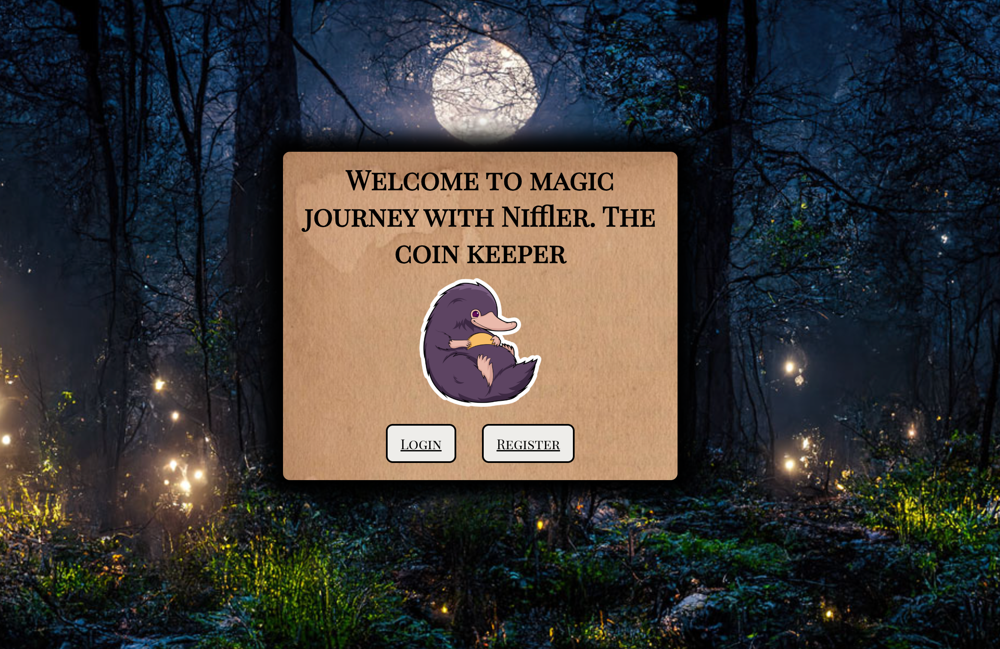

## Проект автоматизированного тестирования приложения Niffler.

<p  align="center">
<code></code>
</p>  

# 🧪 Niffler — UI / API / E2E Тесты

> Проект содержит автоматизированные тесты для проверки сервиса [Niffler](https://github.com/qa-guru/niffler-py-st1): от пользовательского интерфейса до обработки событий через Kafka.

---

## 📌 О чём этот проект

- **UI-тесты**: реализованы по паттерну `PageObject`, с использованием ООП на фреймворке [Selene](https://github.com/pytest-team/pytest-selenium). 
- **UI + DB / API + DB тесты**: данные проверяются как через интерфейс, так и напрямую в базе данных.
- **E2E тесты**: покрывают полный цикл обработки событий:  
  `KAFKA → DB → API`.
- **Отчёты о тестировании**: формируются с помощью [Allure Reports](https://allurereport.org/docs/install/). 
- **Валидация данных**: выполнена с помощью библиотеки [Pydantic](https://docs.pydantic.dev/latest/). 
- **Фикстуры**: созданы специальные фикстуры для управления запуском тестов и подготовкой тестовых данных.
- **Работа с БД**: организована через ORM [SQLAlchemy](https://www.sqlalchemy.org/). 


## 🧰 Локальная настройка и запуск

### 1. Проверьте установку Docker

```bash
docker --version
docker-compose --version
```

### 2. Запустите Niffler

Выполните запуск сервиса согласно инструкции из официального README проекта Niffler.

### 3. Создайте виртуальное окружение

```bash
python -m venv .venv
source .venv/bin/activate   # Linux/Mac
# или
.venv\Scripts\activate      # Windows
```

### 4. Установите зависимости

```bash
pip install -r requirements.txt
```

### 5. Установите Allure CLI

Для генерации отчетов требуется [Allure CLI](https://allurereport.org/docs/install/).   
Убедитесь, что он установлен и доступен в системе.

### 6. Создайте тестового пользователя

Зарегистрируйте нового пользователя через веб-интерфейс по адресу:

🔗 [http://frontend.niffler.dc/](http://frontend.niffler.dc/)

### 7. Настройте `.env`

Создайте файл `.env`, используя `.env.example` как шаблон.  
Добавьте в него учетные данные созданного тестового пользователя.

### 8. Запустите тесты

```bash
pytest --cov=tests
```

### 9. Если будет проблема с импортами, то нужно задать папке niffler-e-2-e-tests-pythonтип Sources Root


